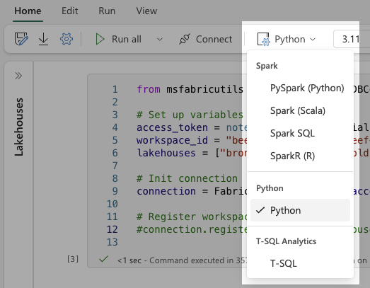
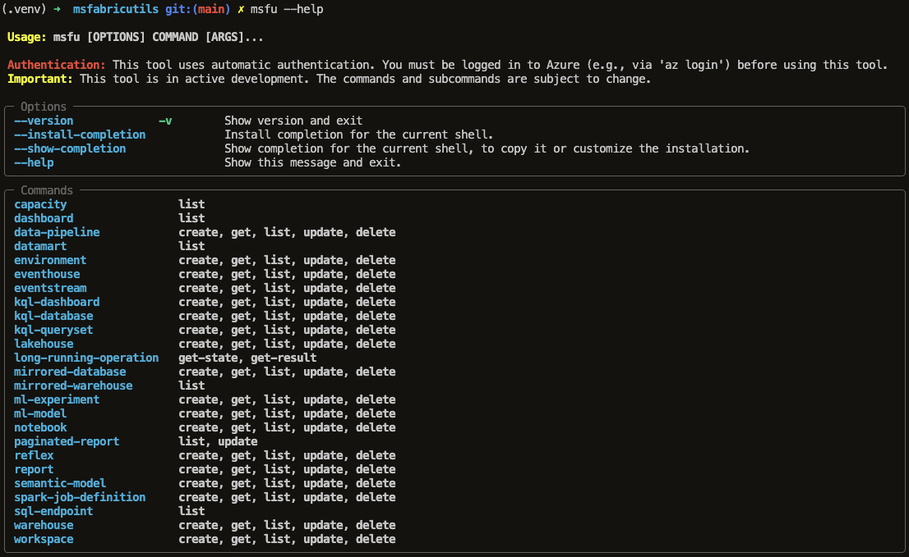

# MSFabricUtils
A collection of Spark-free Python utilities for working with Microsoft Fabric in Python Notebooks.
Mainly focused on Data Engineering tasks utilising [Polars](https://github.com/pola-rs/polars) and [delta-rs](https://github.com/delta-io/delta-rs).



## Installation
```bash
pip install msfabricutils
```

## Features

### Local development first
- Aim to provide a local development "within" Fabric. This means you can develop and run code locally, but reading and writing to Fabric Lakehouses. You can also read and write to Azure Data Lake, or even locally.

### ETL
- Read from delta tables or parquet files with automatic authentication to Azure Data Lake or OneLake
- Common transformations (add audit columns, reorder columns, deduplicate etc.)
- Load delta tables with one of the provided load methods (upsert, overwrite, append etc.)


### Thin Fabric API wrapper
Intregate functions to manage workspaces, lakehouses, notebooks, environments, libraries, etc.
For more details, see the [Fabric API Reference](https://mrjsj.github.io/msfabricutils/core/fabric-api/)

### Fabric API as CLI
CLI for managing workspaces, lakehouses, notebooks, environments, libraries, etc.

To get started, run:
```bash
msfu --help
```




### Fabric DuckDB Connection
Seamless integration between DuckDB and Microsoft Fabric Lakehouses for data exploration and analysis.

- Cross-workspace and cross-lakehouse querying capabilities
- Automatic table registration
- Reading and writing to Onelake outside and inside Fabric
- Support for Delta Lake tables
- Flexible table name referencing (1-part to 4-part names)


## Documentation
For quick start and detailed documentation, examples, and API reference, visit our [GitHub Pages documentation](https://mrjsj.github.io/msfabricutils/).

## Contributing
Contributions are welcome! Here are some ways you can contribute:

- Report bugs and feature requests through GitHub issues
- Submit pull requests for bug fixes or new features
- Improve documentation
- Share ideas for new utilities

## License
This project is licensed under the MIT License - see the LICENSE file for details.
