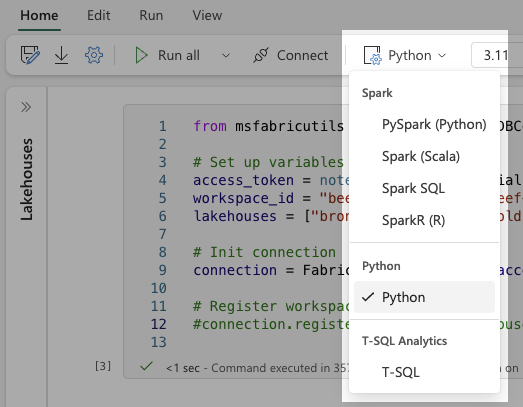

# MSFabricUtils

A collection of **Spark-free** Python utilities for working with Microsoft Fabric in the Python Notebook experience.

## Features

### DuckDB Connection Wrapper
- Seamless integration between DuckDB and Microsoft Fabric Lakehouses
- Cross-lakehouse and cross-workspace querying
- Delta Lake writing features

### Ideas for improvements
- ETL/ELT Helpers
- Lakehouse Management Tools
- Got an idea? Add an issue on [github](https://www.github.com/mrjsj/msfabricutils/issues)

## Installation

```bash
pip install msfabricutils
```

## Quick Start

Ensure you are working in a Python Notebook:



```python
from msfabricutils import FabricDuckDBConnection

#Initialize connection
access_token = notebookutils.credentials.getToken("storage")

conn = FabricDuckDBConnection(access_token=access_token)

#Register lakehouses
conn.register_workspace_lakehouses(
    workspace_id = "your-workspace-id",
    lakehouses = ["sales", "marketing"]
)

# Query across lakehouses
df = conn.sql("""
    SELECT 
        *
    FROM sales.customers
    JOIN marketing.segments USING (customer_id)
""").df()
```


